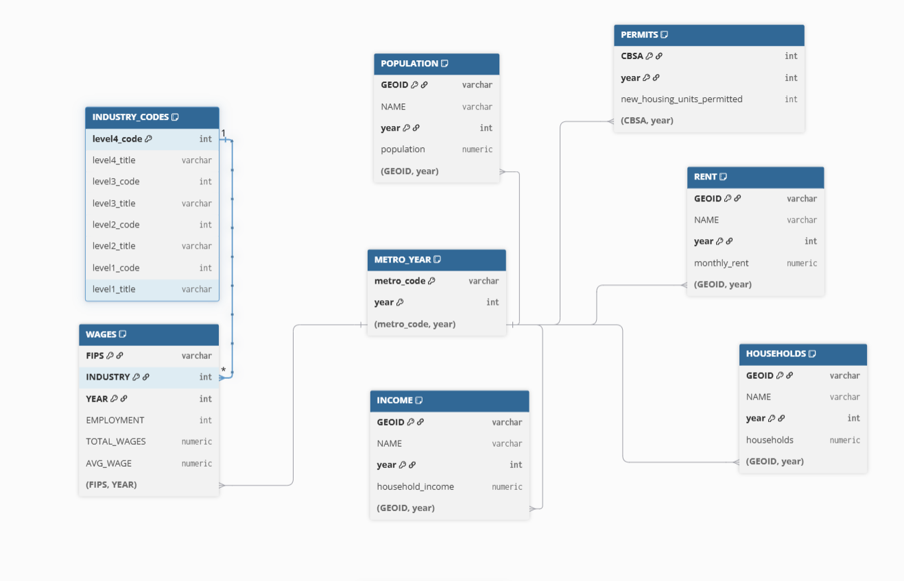

How can something truly be called a necessity if so many people can’t afford it?

In a perfect world, one could live wherever they wanted.
Spoiler alert, this world is far from perfect.

**Affordability isn’t just about price—it’s about access, opportunity, and fairness in everyday life.**

But then again, you have NIMBY's who think their opinions matter more than others.
```{r}
#| echo: false
#| message: false
#| warning: false
#| fig-align: center
#| out.width: 70%

```

NIMBY's are our biggest opposition going back years. Unfortunately for them, many of us, like myself, are here to evicerate them.
With your help, we will be able to turn those N's into Y's and start the YIMBY epidemic.

In the following page, I will show findings about housing affordability in NYC. In addittion, we will dive into what a federal YIMBY-incentive program could look like. At the end, I will introduce an new bill that will change the landscape of affordable housing for future generations.

First, we are going to familiarize ourselves with the data will be using. Below, you will see the relationships between all of our data tables and how they can be related to one another.
```{r}
#| echo: false
#| message: false
#| warning: false
#| fig-align: center
#| out.width: 90%

```

```{r}
#| echo: false
#| message: false
#| warning: false
if(!dir.exists(file.path("data", "mp02"))){
    dir.create(file.path("data", "mp02"), showWarnings=FALSE, recursive=TRUE)
}

library <- function(pkg){
    ## Mask base::library() to automatically install packages if needed
    ## Masking is important here so downlit picks up packages and links
    ## to documentation
    pkg <- as.character(substitute(pkg))
    options(repos = c(CRAN = "https://cloud.r-project.org"))
    if(!require(pkg, character.only=TRUE, quietly=TRUE)) install.packages(pkg)
    stopifnot(require(pkg, character.only=TRUE, quietly=TRUE))
}

library(tidyverse)
library(glue)
library(readxl)
library(tidycensus)

get_acs_all_years <- function(variable, geography="cbsa",
                              start_year=2009, end_year=2023){
    fname <- glue("{variable}_{geography}_{start_year}_{end_year}.csv")
    fname <- file.path("data", "mp02", fname)
    
    if(!file.exists(fname)){
        YEARS <- seq(start_year, end_year)
        YEARS <- YEARS[YEARS != 2020] # Drop 2020 - No survey (covid)
        
        ALL_DATA <- map(YEARS, function(yy){
            tidycensus::get_acs(geography, variable, year=yy, survey="acs1") |>
                mutate(year=yy) |>
                select(-moe, -variable) |>
                rename(!!variable := estimate)
        }) |> bind_rows()
        
        write_csv(ALL_DATA, fname)
    }
    
    read_csv(fname, show_col_types=FALSE)
}

# Household income (12 month)
INCOME <- get_acs_all_years("B19013_001") |>
    rename(household_income = B19013_001)

# Monthly rent
RENT <- get_acs_all_years("B25064_001") |>
    rename(monthly_rent = B25064_001)

# Total population
POPULATION <- get_acs_all_years("B01003_001") |>
    rename(population = B01003_001)

# Total number of households
HOUSEHOLDS <- get_acs_all_years("B11001_001") |>
    rename(households = B11001_001)
```
```{r}
#| echo: false
#| message: false
#| warning: false
get_building_permits <- function(start_year = 2009, end_year = 2023){
    fname <- glue("housing_units_{start_year}_{end_year}.csv")
    fname <- file.path("data", "mp02", fname)
    
    if(!file.exists(fname)){
        HISTORICAL_YEARS <- seq(start_year, 2018)
        
        HISTORICAL_DATA <- map(HISTORICAL_YEARS, function(yy){
            historical_url <- glue("https://www.census.gov/construction/bps/txt/tb3u{yy}.txt")
                
            LINES <- readLines(historical_url)[-c(1:11)]

            CBSA_LINES <- str_detect(LINES, "^[[:digit:]]")
            CBSA <- as.integer(str_sub(LINES[CBSA_LINES], 5, 10))

            PERMIT_LINES <- str_detect(str_sub(LINES, 48, 53), "[[:digit:]]")
            PERMITS <- as.integer(str_sub(LINES[PERMIT_LINES], 48, 53))
            
            data_frame(CBSA = CBSA,
                       new_housing_units_permitted = PERMITS, 
                       year = yy)
        }) |> bind_rows()
        
        CURRENT_YEARS <- seq(2019, end_year)
        
        CURRENT_DATA <- map(CURRENT_YEARS, function(yy){
            current_url <- glue("https://www.census.gov/construction/bps/xls/msaannual_{yy}99.xls")
            
            temp <- tempfile()
            
            download.file(current_url, destfile = temp, mode="wb")
            
            fallback <- function(.f1, .f2){
                function(...){
                    tryCatch(.f1(...), 
                             error=function(e) .f2(...))
                }
            }
            
            reader <- fallback(read_xlsx, read_xls)
            
            reader(temp, skip=5) |>
                na.omit() |>
                select(CBSA, Total) |>
                mutate(year = yy) |>
                rename(new_housing_units_permitted = Total)
        }) |> bind_rows()
        
        ALL_DATA <- rbind(HISTORICAL_DATA, CURRENT_DATA)
        
        write_csv(ALL_DATA, fname)
        
    }
    
    read_csv(fname, show_col_types=FALSE)
}

PERMITS <- get_building_permits()
```
```{r}
#| echo: false
#| message: false
#| warning: false
library(httr2)
library(rvest)
get_bls_industry_codes <- function(){
    fname <- file.path("data", "mp02", "industry-titles.csv")
    library(dplyr)
    library(tidyr)
    library(readr)
    
    if(!file.exists(fname)){
        
        resp <- request("https://www.bls.gov") |> 
            req_url_path("cew", "classifications", "industry", "industry-titles.htm") |>
            req_headers(`User-Agent` = "Mozilla/5.0 (Macintosh; Intel Mac OS X 10.15; rv:143.0) Gecko/20100101 Firefox/143.0") |> 
            req_error(is_error = \(resp) FALSE) |>
            req_perform()
        
        resp_check_status(resp)
        
        naics_table <- resp_body_html(resp) |>
            html_element("#naics_titles") |> 
            html_table() |>
            mutate(title = str_trim(str_remove(str_remove(`Industry Title`, Code), "NAICS"))) |>
            select(-`Industry Title`) |>
            mutate(depth = if_else(nchar(Code) <= 5, nchar(Code) - 1, NA)) |>
            filter(!is.na(depth))
        
        # These were looked up manually on bls.gov after finding 
        # they were presented as ranges. Since there are only three
        # it was easier to manually handle than to special-case everything else
        naics_missing <- tibble::tribble(
            ~Code, ~title, ~depth, 
            "31", "Manufacturing", 1,
            "32", "Manufacturing", 1,
            "33", "Manufacturing", 1,
            "44", "Retail", 1, 
            "45", "Retail", 1,
            "48", "Transportation and Warehousing", 1, 
            "49", "Transportation and Warehousing", 1
        )
        
        naics_table <- bind_rows(naics_table, naics_missing)
        
        naics_table <- naics_table |> 
            filter(depth == 4) |> 
            rename(level4_title=title) |> 
            mutate(level1_code = str_sub(Code, end=2), 
                   level2_code = str_sub(Code, end=3), 
                   level3_code = str_sub(Code, end=4)) |>
            left_join(naics_table, join_by(level1_code == Code)) |>
            rename(level1_title=title) |>
            left_join(naics_table, join_by(level2_code == Code)) |>
            rename(level2_title=title) |>
            left_join(naics_table, join_by(level3_code == Code)) |>
            rename(level3_title=title) |>
            select(-starts_with("depth")) |>
            rename(level4_code = Code) |>
            select(level1_title, level2_title, level3_title, level4_title, 
                   level1_code,  level2_code,  level3_code,  level4_code) |>
            drop_na() |>
            mutate(across(contains("code"), as.integer))
        
        write_csv(naics_table, fname)
    }
    
    read_csv(fname, show_col_types=FALSE)
}

INDUSTRY_CODES <- get_bls_industry_codes()
```
```{r}
#| echo: false
#| message: false
#| warning: false
library(httr2)
library(rvest)
get_bls_qcew_annual_averages <- function(start_year=2009, end_year=2023){
    fname <- glue("bls_qcew_{start_year}_{end_year}.csv.gz")
    fname <- file.path("data", "mp02", fname)
    
    YEARS <- seq(start_year, end_year)
    YEARS <- YEARS[YEARS != 2020] # Drop Covid year to match ACS
    
    if(!file.exists(fname)){
        ALL_DATA <- map(YEARS, .progress=TRUE, possibly(function(yy){
            fname_inner <- file.path("data", "mp02", glue("{yy}_qcew_annual_singlefile.zip"))
            
            if(!file.exists(fname_inner)){
                request("https://www.bls.gov") |> 
                    req_url_path("cew", "data", "files", yy, "csv",
                                 glue("{yy}_annual_singlefile.zip")) |>
                    req_headers(`User-Agent` = "Mozilla/5.0 (Macintosh; Intel Mac OS X 10.15; rv:143.0) Gecko/20100101 Firefox/143.0") |> 
                    req_retry(max_tries=5) |>
                    req_perform(fname_inner)
            }
            
            if(file.info(fname_inner)$size < 755e5){
                warning(sQuote(fname_inner), "appears corrupted. Please delete and retry this step.")
            }
            
            read_csv(fname_inner, 
                     show_col_types=FALSE) |> 
                mutate(YEAR = yy) |>
                select(area_fips, 
                       industry_code, 
                       annual_avg_emplvl, 
                       total_annual_wages, 
                       YEAR) |>
                filter(nchar(industry_code) <= 5, 
                       str_starts(area_fips, "C")) |>
                filter(str_detect(industry_code, "-", negate=TRUE)) |>
                mutate(FIPS = area_fips, 
                       INDUSTRY = as.integer(industry_code), 
                       EMPLOYMENT = as.integer(annual_avg_emplvl), 
                       TOTAL_WAGES = total_annual_wages) |>
                select(-area_fips, 
                       -industry_code, 
                       -annual_avg_emplvl, 
                       -total_annual_wages) |>
                # 10 is a special value: "all industries" , so omit
                filter(INDUSTRY != 10) |> 
                mutate(AVG_WAGE = TOTAL_WAGES / EMPLOYMENT)
        })) |> bind_rows()
        
        write_csv(ALL_DATA, fname)
    }
    
    ALL_DATA <- read_csv(fname, show_col_types=FALSE)
    
    ALL_DATA_YEARS <- unique(ALL_DATA$YEAR)
    
    YEARS_DIFF <- setdiff(YEARS, ALL_DATA_YEARS)
    
    if(length(YEARS_DIFF) > 0){
        stop("Download failed for the following years: ", YEARS_DIFF, 
             ". Please delete intermediate files and try again.")
    }
    
    ALL_DATA
}

WAGES <- get_bls_qcew_annual_averages()
```

Next, we will see some of the findings that we can extract from this data.
To begin, we seek out the top 5 CBSAs that permitted the largest number of new housing in the 2010's.

```{r}
#| echo: false
#| message: false
#| warning: false
library(scales)

CBSA_NAMES <- INCOME |>
  filter(year == 2019) |>                
  select(GEOID, NAME) |>
  distinct() |>
  mutate(CBSA = as.integer(GEOID))

PERMITS_2010s <- PERMITS |>
  filter(year >= 2010, year <= 2019) |>
  group_by(CBSA) |>
  summarize(
    new_units = sum(new_housing_units_permitted, na.rm = TRUE),
    .groups = "drop"
  )

PERMITS_2010s_named <- PERMITS_2010s |>
  left_join(CBSA_NAMES, by = "CBSA") |>
  select(CBSA, NAME, new_units)

TOP_CBSA <- PERMITS_2010s_named |>
  arrange(desc(new_units)) |>
  slice(1)

TOP_5_CBSA <- PERMITS_2010s_named |>
  arrange(desc(new_units)) |>
  slice_head(n = 5)

DT::datatable(
  TOP_5_CBSA,
  caption = "Top 5 CBSAs with the Most New Housing Units Permitted (2010–2019, using 2019 CBSA Names)",
  options = list(dom = 't', scrollX = TRUE)
)
```

As we can see, the CBSA that permitted the largest number of new housing units between 2010 and 2019 was CBSA in `r TOP_CBSA$NAME`.

Next, we'll take a look a CBSA 10740, located in Alburquerque, New Mexico and analyze their yearly addition of new housing units.

```{r}
#| echo: false
#| message: false
#| warning: false

library(ggplot2)

abq_by_year_full <- PERMITS |>
  filter(CBSA == 10740) |>
  group_by(year) |>
  summarize(
    total_units = sum(new_housing_units_permitted, na.rm = TRUE),
    .groups = "drop"
  ) |>
  arrange(year)

abq_peak <- abq_by_year_full |> slice_max(total_units, n = 1)

ggplot(abq_by_year_full, aes(x = year, y = total_units)) +
  geom_line(size = 1.2) +
  geom_point(size = 3) +
  scale_y_continuous(labels = comma) +
  labs(
    title = "New Units Permitted per Year in CBSA 10740",
    x = "Year",
    y = "New Housing Units Permitted"
  ) +
  theme_minimal(base_size = 14)
```

As shown in the graph above, the number of new housing units permitted were on a steady decline up until the COVID pandemic. Then, in 2021, CBSA 10740 had its highest number of new housing units permitted, with `r abq_peak$total_units` units.

Next, we go over to look at average income per state, more specifically in the year 2015.
```{r}
#| echo: false
#| message: false
#| warning: false
library(usmap)
library(viridis)

# helper df to map state abbreviations to full names (incl. DC, PR)
state_df <- data.frame(
  abb  = c(state.abb, "DC", "PR"),
  name = c(state.name, "District of Columbia", "Puerto Rico"),
  stringsAsFactors = FALSE
)

# compute per-state average individual income in 2015
state_income_2015 <- INCOME |>
  filter(year == 2015) |>
  select(GEOID, NAME, household_income, year) |>
  left_join(
    HOUSEHOLDS |> select(GEOID, households, year),
    by = c("GEOID", "year")
  ) |>
  left_join(
    POPULATION |> select(GEOID, population, year),
    by = c("GEOID", "year")
  ) |>
  mutate(
    total_income = household_income * households,
    # extract two-letter state/territory code from "NAME"
    state_abbr = str_extract(NAME, ", (.{2})") |> str_remove(", ")
  ) |>
  group_by(state_abbr) |>
  summarize(
    total_income_state        = sum(total_income, na.rm = TRUE),
    total_population_state    = sum(population, na.rm = TRUE),
    avg_individual_income_num = total_income_state / total_population_state,
    .groups = "drop"
  ) |>
  # attach full state name so usmap is happy
  left_join(
    state_df,
    by = c("state_abbr" = "abb")
  ) |>
  rename(state_full = name)

# prep data for usmap:
# plot_usmap() needs a column literally called `state`
plot_data_2015 <- state_income_2015 |>
  select(
    state = state_full,
    avg_individual_income_num
  )

# draw choropleth
plot_usmap(
  data = plot_data_2015,
  values = "avg_individual_income_num",
  color = "white"
) +
  scale_fill_viridis_c(
    option = "plasma",
    direction = -1,
    labels = dollar_format(accuracy = 1)
  ) +
  labs(
    title = "Average Individual Income by State (2015)",
    fill = "Income (USD)"
  ) +
  theme(legend.position = "right")

highest_income_state <- state_income_2015 |>
  slice_max(avg_individual_income_num, n = 1) |>
  mutate(
    avg_income_dollar = dollar(avg_individual_income_num, accuracy = 1)
  ) |>
  select(state_full, avg_income_dollar)
```

The map above shows all 50 states average income. However, it does not include additional US territories that are also included in the data. Therefore, more analysis has to be completed. That's when you figure out that the `r highest_income_state$state_full` had the highest average individual income for 2015, coming in at `r highest_income_state$avg_income_dollar`. Something, people in the government should be familiar too.

Next findings show which CBSA had the most amount of data scientists in the last 5 years.
```{r}
#| echo: false
#| message: false
#| warning: false

t1 <- INCOME |>
  select(GEOID, NAME) |>
  distinct() |>
  mutate(
    short_cbsa = str_sub(GEOID, 1, 4),
    std_cbsa  = paste0("C", short_cbsa)
  )

t2 <- WAGES |>
  filter(INDUSTRY == 5182) |>
  transmute(
    YEAR,
    EMPLOYMENT,
    std_cbsa = FIPS 
  )

ds_joined <- inner_join(
  t1,
  t2,
  join_by(std_cbsa == std_cbsa)
)

most_ds_per_year <- ds_joined |>
  group_by(YEAR) |>
  slice_max(order_by = EMPLOYMENT, n = 1, with_ties = FALSE) |>
  ungroup() |>
  arrange(YEAR) |>
  select(
    YEAR,
    cbsa_name = NAME,
    cbsa_code = GEOID,
    employment_5182 = EMPLOYMENT
  )

DT::datatable(
  most_ds_per_year |>
    arrange(desc(YEAR)) |>
    slice_head(n = 5) |>
    select(YEAR, cbsa_code, cbsa_name),   # only show these columns
  caption = "Top 5 Most Recent Years – CBSA with the Most Data Scientists (NAICS 5182)",
  options = list(dom = 't', scrollX = TRUE)
)

nyc_last_year <- most_ds_per_year |>
  filter(str_detect(cbsa_name, regex("^New York", ignore_case = TRUE))) |>
  slice_max(order_by = YEAR, n = 1)
```

In 4 out of the last 5 years, San Francisco has had the most data scientists. To get a better understanding of these part of the data, I wanted to see the NYC CBSA and if they have ever had the most data scientists. After taking a closer look at more previous years, you are able to find that `r nyc_last_year$YEAR` was the last year that the NYC CBSA led the country for data scientists.

The last thing we take a look at initially, is the total wages in the NYC CBSA. We look specifically into the wages that come from the finance and insurance industries to figure the percentage this is of the total wages.
```{r}
#| echo: false
#| message: false
#| warning: false
nyc_wages <- WAGES |>
  filter(FIPS == "C3562") |>
  group_by(YEAR) |>
  summarize(
    total_wages_all = sum(TOTAL_WAGES, na.rm = TRUE),
    total_wages_finance = sum(TOTAL_WAGES[INDUSTRY == 52], na.rm = TRUE),
    finance_share = total_wages_finance / total_wages_all,
    .groups = "drop"
  ) |>
  mutate(finance_share_pct = percent(finance_share, accuracy = 0.1))
nyc_peak <- nyc_wages |> slice_max(finance_share, n = 1)

ggplot(nyc_wages, aes(x = YEAR, y = finance_share)) +
  geom_line(size = 1.2, color = "steelblue") +
  geom_point(size = 3, color = "darkred") +
  scale_y_continuous(labels = scales::percent_format(accuracy = 1)) +
  labs(
    title = "NYC Wages Earned in Finance & Insurance (NAICS 52)",
    x = "Year",
    y = "Finance Share of Total Wages"
  ) +
  theme_minimal(base_size = 14)

```

We look at various years to find no trend. However, we are able to find the peak in the year `r nyc_peak$YEAR`, with about 5% share of the total wages for the CBSA for the year.

To keep on the trend of familiriaty with the dataset, we will see more visualizations to show different types of relationships.
```{r}
#| echo: false
#| message: false
#| warning: false
cbsa_income_rent_2009 <- INCOME |>
  filter(year == 2009) |>
  select(GEOID, NAME, household_income, year) |>
  left_join(
    RENT |>
      filter(year == 2009) |>
      select(GEOID, year, monthly_rent),
    by = c("GEOID", "year")
  ) |>
  mutate(
    CBSA = str_remove(NAME, ",.*"),       
    monthly_income = household_income / 12
  ) |>
  filter(!is.na(monthly_income), !is.na(monthly_rent))

ggplot(cbsa_income_rent_2009,
       aes(x = monthly_income, y = monthly_rent)) +
  geom_point(alpha = 0.6) +
  geom_smooth(method = "lm", se = TRUE, linewidth = 0.7, linetype = "solid") +
  scale_x_continuous(labels = dollar_format()) +
  scale_y_continuous(labels = dollar_format()) +
  labs(
    title = "Monthly Rent vs. Monthly Household Income (2009)",
    x = "Average Monthly Household Income (USD)",
    y = "Median Gross Rent (USD)"
  ) +
  theme_minimal(base_size = 13)
```
The visualization above shows us the relationship between monthly rent and average household income per CBSA in 2009.

Each dot in the scatter plot refers to a different CBSA.

As you could see, there is a positive correlation between the cost of rent and household income.

```{r}
#| echo: false
#| message: false
#| warning: false
cbsa_crosswalk <- INCOME |>
  filter(year == 2009) |>
  select(GEOID, NAME) |>
  distinct() |>
  mutate(
    cbsa_code = str_replace_all(GEOID, "[^0-9]", ""),
    cbsa_name = str_remove(NAME, ",.*")
  ) |>
  select(cbsa_code, cbsa_name)

cbsa_yearly <- WAGES |>
  mutate(
    cbsa_code = str_replace_all(FIPS, "[^0-9]", ""),
    sector2   = str_sub(as.character(INDUSTRY), 1, 2)
  ) |>
  group_by(cbsa_code, YEAR) |>
  summarize(
    total_employment  = sum(EMPLOYMENT, na.rm = TRUE),
    health_employment = sum(if_else(sector2 == "62", EMPLOYMENT, 0L), na.rm = TRUE),
    .groups = "drop"
  ) |>
  mutate(health_share = health_employment / total_employment)

top_cbsa_codes <- cbsa_yearly |>
  group_by(cbsa_code) |>
  summarize(total_emp_all_years = sum(total_employment, na.rm = TRUE), .groups = "drop") |>
  slice_max(total_emp_all_years, n = 5) |>
  pull(cbsa_code)

cbsa_focus <- cbsa_yearly |>
  filter(cbsa_code %in% top_cbsa_codes) |>
  left_join(cbsa_crosswalk, by = "cbsa_code") |>
  mutate(
    cbsa_label = if_else(is.na(cbsa_name), cbsa_code, cbsa_name),
    cbsa_label = paste0(cbsa_label, "0")   
  )

ggplot(
  cbsa_focus,
  aes(x = YEAR, y = health_share, color = cbsa_label, group = cbsa_label)
) +
  geom_line(linewidth = 1.2, alpha = 0.8) +
  geom_point(size = 2) +
  scale_y_continuous(labels = percent_format(accuracy = 0.1)) +
  labs(
    title = "Health Care&Social Services vs Total Employment",
    x = "Year",
    y = "NAICS 62 Share of Total Employment",
    color = "CBSA"
  ) +
  theme_minimal(base_size = 13) +
  theme(
    plot.title = element_text(face = "bold"),
    legend.position = "bottom"
  )
```
The next visualization shows the relationship between total employment and total employment in the health care and social services sector across different the 5 CBSAs with the highest employment total.

Over time, depending on the CBSA, the share is volatile and can either decrease or increase. The time where it mostly increases is in the year 2020, due to the COVID-19 pandemic.

```{r}
#| echo: false
#| message: false
#| warning: false
library(gghighlight)
cbsa_household_size <- HOUSEHOLDS |>
  select(GEOID, NAME, households, year) |>
  left_join(
    POPULATION |> select(GEOID, population, year),
    by = c("GEOID", "year")
  ) |>
  mutate(
    CBSA = str_remove(NAME, ",.*"), 
    avg_hh_size = population / households
  ) |>
  filter(
    !is.na(avg_hh_size),
    households > 0,
    population > 0
  )

cbsa_household_size <- cbsa_household_size |>
  mutate(
    CBSA_clean = case_when(
      str_detect(CBSA, regex("New York", ignore_case = TRUE)) ~ "New York CBSA",
      str_detect(CBSA, regex("Los Angeles", ignore_case = TRUE)) ~ "Los Angeles CBSA",
      TRUE ~ CBSA
    )
  )

ggplot(
  cbsa_household_size,
  aes(x = year, y = avg_hh_size, group = CBSA_clean, color = CBSA_clean)
) +
  geom_line(alpha = 0.4, linewidth = 0.6) +
  gghighlight(
    CBSA_clean %in% c("New York CBSA", "Los Angeles CBSA"),
    label_key = CBSA_clean,
    use_direct_label = TRUE,
    unhighlighted_params = list(color = "gray80", alpha = 0.4, linewidth = 0.4)
  ) +
  scale_y_continuous(labels = number_format(accuracy = 0.1)) +
  labs(
    title = "Evolution of Average Household Size Over Time",
    x = "Year",
    y = "Average Household Size",
    color = "CBSA"
  ) +
  theme_minimal(base_size = 13) +
  theme(
    legend.position = "none",
    plot.title = element_text(face = "bold")
  )
```
The third visualization is the evolution of the average household size over time. 

We highlighted two specific CBSAs, the NY and LA ones, to take a closer look at the evolution.

We can infer that the average household size, especially in those CBAs, has been steadily decreasing.

The next two visualizations will have to deal with rent burden.

We are going to create an rent-to-income ratio and compare the results around the CBSAs.
```{r}
#| echo: false
#| message: false
#| warning: false
income_rent <- INCOME |>
  select(GEOID, NAME, year, household_income) |>
  left_join(
    RENT |>
      select(GEOID, NAME, year, monthly_rent),
    by = c("GEOID", "NAME", "year")
  ) |>
  mutate(
    cbsa_code = str_replace_all(GEOID, "[^0-9]", ""),
    cbsa_name = str_remove(NAME, ",.*")
  ) |>
  filter(!is.na(household_income),
         !is.na(monthly_rent),
         household_income > 0,
         monthly_rent > 0) |>
  select(cbsa_code, cbsa_name, year, household_income, monthly_rent)

income_rent <- income_rent |>
  mutate(
    rent_burden_raw = (12 * monthly_rent) / household_income
  )

income_rent <- income_rent |>
  mutate(
    rent_burden_std = (rent_burden_raw - 0.30) / 0.05
  )

miami_rent_burden <- income_rent |>
  filter(cbsa_code %in% c("33100", "33124"))

ggplot(miami_rent_burden, aes(x = year, y = rent_burden_raw)) +
  geom_line(color = "#1f78b4", linewidth = 1.2) +
  geom_point(color = "#1f78b4", size = 2) +
  geom_hline(yintercept = 0.30, linetype = "dashed", color = "red") +
  scale_y_continuous(
  breaks = seq(0.2775, 0.30, by = 0.0025),   
  labels = scales::label_percent(accuracy = 0.01) 
) +
  labs(
    title = "Rent Burden Over Time — Miami CBSAs",
    x = "Year",
    y = "Rent-to-Income Ratio",
  ) +
  theme_minimal(base_size = 13) +
  theme(plot.title = element_text(face = "bold"))
```
In the visualization above, we take a look at the rent burden in the CBSAs (33100 + 33124) in the Miami metro area. To understand better, the dashed red line represents the 30% affordability benchmark.

As you could see, the rent burden for South Floridians has been on an exponential rise post pandemic.
```{r}
#| echo: false
#| message: false
#| warning: false
latest_year <- max(income_rent$year, na.rm = TRUE)

top_bottom_cbsas <- income_rent |>
  filter(year == latest_year) |>
  arrange(desc(rent_burden_raw)) |>
  mutate(cbsa_name = str_trunc(cbsa_name, 40)) |>
  slice_head(n = 10) |>
  bind_rows(
    income_rent |>
      filter(year == latest_year) |>
      arrange(rent_burden_raw) |>
      slice_head(n = 10)
  ) |>
  mutate(
    group = if_else(rent_burden_raw >= median(rent_burden_raw), "Highest", "Lowest")
  )

ggplot(top_bottom_cbsas, aes(x = reorder(cbsa_name, rent_burden_raw), y = rent_burden_raw, fill = group)) +
  geom_col() +
  coord_flip() +
  scale_y_continuous(labels = percent_format(accuracy = 1)) +
  scale_fill_manual(values = c("Highest" = "#e31a1c", "Lowest" = "#33a02c")) +
  labs(
    title = glue::glue("CBSAs & Rent Burdens ({latest_year})"),
    x = "CBSA",
    y = "Rent-to-Income Ratio",
    fill = "Group"
  ) +
  theme_minimal(base_size = 13) +
  theme(plot.title = element_text(face = "bold"))
```
The next visualization shows the rent burden in 2023 for CBSA's across the nation.

We are highlighting the CBSAs with the highest and lowest rent burdens.

To stay with the trend from the first rent-burden visual, one can assume that the rent burden in the entire state of Florida is increasing in all areas of the region.

Next, we are going to look at housing growth within the CBSAs.

We are going to construct two metrics; one will allow us to see the housing growth based on population of a CBSA and number of new housing units permitted for the year. The other metric will compare the housing permits to the population growth over a 5 year lookback windown.

Lets first take a look at the first metric.
```{r}
#| echo: false
#| message: false
#| warning: false
#| include: true
library(slider)

cbsa_housing <- POPULATION |>
  select(GEOID, NAME, year, population) |>
  mutate(
    cbsa_code = str_replace_all(GEOID, "[^0-9]", ""),
    cbsa_name = str_remove(NAME, ",.*")
  ) |>
  left_join(
    PERMITS |>
      mutate(cbsa_code = as.character(CBSA)) |>
      select(cbsa_code, year, new_housing_units_permitted),
    by = c("cbsa_code", "year")
  ) |>
  filter(!is.na(population), !is.na(new_housing_units_permitted)) |>
  arrange(cbsa_code, year)

cbsa_housing <- cbsa_housing |>
  group_by(cbsa_code) |>
  mutate(
    population_lag5 = lag(population, 5),
    pop_growth_5yr  = population - population_lag5
  ) |>
  ungroup()

cbsa_housing <- cbsa_housing |>
  mutate(
    housing_growth_instant = new_housing_units_permitted / population,

    housing_growth_rate = if_else(
      !is.na(pop_growth_5yr) & pop_growth_5yr > 0,
      new_housing_units_permitted / pop_growth_5yr,
      NA_real_
    )
  )

cbsa_housing <- cbsa_housing |>
  mutate(
    housing_growth_instant_std = round(
      (housing_growth_instant - mean(housing_growth_instant, na.rm = TRUE)) /
      sd(housing_growth_instant, na.rm = TRUE),
      4
    ),
    housing_growth_rate_std = round(
      (housing_growth_rate - mean(housing_growth_rate, na.rm = TRUE)) /
      sd(housing_growth_rate, na.rm = TRUE),
      4
    )
  )

cbsa_housing <- cbsa_housing |>
  mutate(
    housing_growth_composite = 0.5 * housing_growth_instant_std +
                               0.5 * housing_growth_rate_std,
    housing_growth_composite_std = round(
      (housing_growth_composite - mean(housing_growth_composite, na.rm = TRUE)) /
      sd(housing_growth_composite, na.rm = TRUE),
      4
    )
  )

cbsa_housing <- cbsa_housing |>
  group_by(cbsa_code) |>
  arrange(cbsa_code, year) |>
  mutate(
    housing_growth_instant_roll5   = slide_dbl(housing_growth_instant_std, mean, .before = 4, .complete = TRUE, na.rm = TRUE),
    housing_growth_rate_roll5      = slide_dbl(housing_growth_rate_std,    mean, .before = 4, .complete = TRUE, na.rm = TRUE),
    housing_growth_composite_roll5 = slide_dbl(housing_growth_composite_std, mean, .before = 4, .complete = TRUE, na.rm = TRUE)
  ) |>
  ungroup()

latest_year <- max(cbsa_housing$year, na.rm = TRUE)

top_instant <- cbsa_housing |>
  filter(year == latest_year, !is.na(housing_growth_instant_std)) |>
  arrange(desc(housing_growth_instant_std)) |>
  slice_head(n = 10) |>
  select(cbsa_code, cbsa_name, year, housing_growth_instant_std)

bottom_instant <- cbsa_housing |>
  filter(year == latest_year, !is.na(housing_growth_instant_std)) |>
  arrange(housing_growth_instant_std) |>
  slice_head(n = 10) |>
  select(cbsa_code, cbsa_name, year, housing_growth_instant_std)

top_rate <- cbsa_housing |>
  filter(year == latest_year, !is.na(housing_growth_rate_std)) |>
  arrange(desc(housing_growth_rate_std)) |>
  slice_head(n = 10) |>
  select(cbsa_code, cbsa_name, year, housing_growth_rate_std)

bottom_rate <- cbsa_housing |>
  filter(year == latest_year, !is.na(housing_growth_rate_std)) |>
  arrange(housing_growth_rate_std) |>
  slice_head(n = 10) |>
  select(cbsa_code, cbsa_name, year, housing_growth_rate_std)

top_composite <- cbsa_housing |>
  filter(year == latest_year, !is.na(housing_growth_composite_std)) |>
  arrange(desc(housing_growth_composite_std)) |>
  slice_head(n = 10) |>
  select(cbsa_code, cbsa_name, year, housing_growth_composite_std)

bottom_composite <- cbsa_housing |>
  filter(year == latest_year, !is.na(housing_growth_composite_std)) |>
  arrange(housing_growth_composite_std) |>
  slice_head(n = 10) |>
  select(cbsa_code, cbsa_name, year, housing_growth_composite_std)

DT::datatable(top_instant,
          caption = glue::glue("Top 10 CBSAs by Instantaneous Housing Growth (Std) — {latest_year}"),
          options = list(pageLength = 10))

DT::datatable(bottom_instant,
          caption = glue::glue("Bottom 10 CBSAs by Instantaneous Housing Growth (Std) — {latest_year}"),
          options = list(pageLength = 10))
```
After coming up with our metric, we are able to separate the top 10 and bottom 10 CBSA's in terms of instantaneous housing growth. 

To explain in English terms, lets take a look at the first table. 

Myrtle Beach CBSA was one of the most construction-intensive metros in the entire country in 2023 — building new housing far faster than typical cities its size. (Over nine standard deviations above the national average)

In contrast in the second table, we can see see that the Decatur CBSA built noticeably fewer new homes per resident than most U.S. metro areas — about one standard deviation below average.
 
Next, we will take a look at the second metric.

```{r}
#| echo: false
#| message: false
#| warning: false
DT::datatable(top_rate,
          caption = glue::glue("Top 10 CBSAs by Rate-Based Housing Growth (Std) — {latest_year}"),
          options = list(pageLength = 10))

DT::datatable(bottom_rate,
          caption = glue::glue("Bottom 10 CBSAs by Rate-Based Housing Growth (Std) — {latest_year}"),
          options = list(pageLength = 10))
```
After coming up with our second metric, we are able to separate the top 10 and bottom 10 CBSA's in terms of rate-based housing growth.

To explain better, we can see that in 2023, the Springfield CBSA had a housing_growth_rate_std of +2.1026, meaning it was building housing at a rate significantly higher than most U.S. metro areas relative to its recent population growth.

Now on the other side of the spectrum, in 2023, the Manhattan CBSA had a housing_growth_rate_std of −0.141, meaning it was very close to the national average, with just a slight tendency to underbuild relative to population growth.

The last metric we will take a look is a composite score that combines the first two metrics.

Once we figured out the metric, we are going to identify the CBSA's that do well and poor with this measure. This will give us an idea to the Metro areas that are most YIMBY friendly.
```{r}
#| echo: false
#| message: false
#| warning: false
DT::datatable(top_composite,
          caption = glue::glue("Top 10 CBSAs by Composite Housing Growth (Std) — {latest_year}"),
          options = list(pageLength = 10))

DT::datatable(bottom_composite,
          caption = glue::glue("Bottom 10 CBSAs by Composite Housing Growth (Std) — {latest_year}"),
          options = list(pageLength = 10))
```
Therefore, in 2023, the Punta Gorda CBSA had a housing_growth_composite_std of +3.5413, meaning its overall pace of housing development was exceptionally strong.

That makes Punta Gorda one of the most construction-active metros in the country when you consider both its raw building rate and how well housing supply is keeping up with population growth.

On the other hand, in 2023, the Morgantown CBSA had a housing_growth_composite_std of −1.137, meaning its overall housing growth pace was moderately below the national average.

A value of −1.14 indicates Morgantown’s combined housing indicators — both how much it’s building and how well it’s keeping up with population growth — were a little over one standard deviation below what’s typical across U.S. metros.

The last thing we'll do before we introduce the bill is to visualize the relationship between our Rent Burden and Housing Growth metrics.

```{r}
#| echo: false
#| message: false
#| warning: false
#| include: true

library(ggrepel)

cbsa_merged <- inner_join(
  income_rent,                                             
  cbsa_housing,                                            
  by = c("cbsa_code","year"),
  suffix = c(".rent", ".house")
) %>%
  mutate(cbsa_name = coalesce(cbsa_name.rent, cbsa_name.house)) %>%
  select(cbsa_code, cbsa_name, year, rent_burden_raw, population, housing_growth_composite_std)

min_y <- min(cbsa_merged$year, na.rm = TRUE)
max_y <- max(cbsa_merged$year, na.rm = TRUE)
start_years <- seq(min_y, min(min_y + 2, max_y))
end_years   <- seq(max(max_y - 2, min_y), max_y)

# Build summary used by the YIMBY plot
cbsa_summary <- cbsa_merged %>%
  group_by(cbsa_code, cbsa_name) %>%
  summarize(
    rent_burden_start   = mean(rent_burden_raw[year %in% start_years], na.rm = TRUE),
    rent_burden_end     = mean(rent_burden_raw[year %in% end_years],   na.rm = TRUE),
    rent_burden_change  = rent_burden_end - rent_burden_start,
    pop_start           = mean(population[year %in% start_years], na.rm = TRUE),
    pop_end             = mean(population[year %in% end_years],   na.rm = TRUE),
    pop_growth          = (pop_end - pop_start) / pmax(pop_start, 1),
    housing_growth_mean = mean(housing_growth_composite_std, na.rm = TRUE),
    .groups = "drop"
  ) %>%
  filter(
    is.finite(rent_burden_start),
    is.finite(rent_burden_end),
    is.finite(pop_start), pop_start > 0,
    is.finite(pop_end),
    is.finite(pop_growth),
    is.finite(housing_growth_mean)
  )
num_si <- scales::label_number(scale_cut = scales::cut_short_scale())

cbsa_summary_simple <- cbsa_merged |>
  group_by(cbsa_code, cbsa_name) |>
  summarize(
    avg_rent_burden    = mean(rent_burden_raw, na.rm = TRUE),
    avg_housing_growth = mean(housing_growth_composite_std, na.rm = TRUE),
    avg_population     = mean(population, na.rm = TRUE),
    .groups = "drop"
  ) |>
  filter(is.finite(avg_rent_burden), is.finite(avg_housing_growth))

ggplot(cbsa_summary_simple,
       aes(x = avg_rent_burden, y = avg_housing_growth, size = avg_population)) +
  geom_point(alpha = 0.7, color = "#1f78b4") +
  scale_x_continuous(labels = percent_format(accuracy = 1)) +
  scale_size_continuous(labels = num_si, name = "Avg Population") +
  labs(
    title = "Rent Burden vs Housing Growth Across All CBSAs",
    subtitle = "Each point = one CBSA; size = average population",
    x = "Average Rent Burden (share of income)",
    y = "Average Housing Growth (standardized)"
  ) +
  theme_minimal(base_size = 13) +
  theme(plot.title = element_text(face = "bold"),
        legend.position = "bottom")
```
In the scatter plot above, we are trying to interpret if there is any correlation between average rent burden and average housing growth while also trying to show the size of population of each CBSA. 

Each dot in the scatter plot represents a different CBSA.

Unfortunately, we do not see any correlation between the two. 
```{r}
#| echo: false
#| message: false
#| warning: false
#| include: true
ny_code <- "35620"

ny_data <- cbsa_merged |>
  filter(cbsa_code == ny_code, year >= 2014, year <= 2018) |>
  group_by(year) |>
  summarize(
    rent_burden = mean(rent_burden_raw, na.rm = TRUE),
    housing_growth = mean(housing_growth_composite_std, na.rm = TRUE),
    .groups = "drop"
  )

ggplot(ny_data, aes(x = year)) +
  geom_line(aes(y = rent_burden * 100, color = "Rent Burden"), linewidth = 1.3) +
  geom_line(aes(y = housing_growth, color = "Housing Growth"), linewidth = 1.3, linetype = "dashed") +
  
  scale_y_continuous(
    name = "Rent Burden %",
    limits = c(-10, 30),                      
    breaks = seq(-10, 30, by = 10),           
    sec.axis = sec_axis(~ ., name = "Housing Growth (Standardized)")
  ) +
  
  scale_color_manual(
    values = c("Rent Burden" = "#1b9e77", "Housing Growth" = "#d95f02"),
    name = "Metric"
  ) +
  labs(
    title = "Rent Burden and Housing Growth — New York CBSA (35620)",
    x = "Year"
  ) +
  theme_minimal(base_size = 13) +
  theme(
    plot.title = element_text(face = "bold"),
    legend.position = "bottom"
  )
```
In the line graph above, we spotlight the CBSA in New York (35620) to show the similarities between the trend of both their rent burden and housing growth from 2014 to 2018.

As you can see, you may be able to see that trend for both metrics follow similar paths. However, it is not clear to show that they both follow the same trends.

The last visualization we are going to see is to search which CBSAs identify as the most YIMBY.

To determine, we have 4 criteria that each has to meet:
- had relatively high rent burden in the early part of the study period
- have had a decrease in rent burden over the study period
- have had population growth over the study period
- have had above-average housing growth during the study period

```{r}
#| echo: false
#| message: false
#| warning: false
#| include: true
rb_start_med <- median(cbsa_summary$rent_burden_start, na.rm = TRUE)

cbsa_summary <- cbsa_summary %>%
  mutate(
    yimby_flag = (rent_burden_start > rb_start_med) &
                 (rent_burden_change < 0) &
                 (pop_growth > 0) &
                 (housing_growth_mean > 0)
  )

yimby_cbsas <- cbsa_summary %>%
  filter(yimby_flag) %>%
  arrange(desc(housing_growth_mean)) %>%
  slice_head(n = 12)

ggplot(cbsa_summary,
       aes(x = rent_burden_change, y = housing_growth_mean, color = yimby_flag)) +
  geom_hline(yintercept = 0, linetype = "dashed", color = "gray40") +
  geom_vline(xintercept = 0, linetype = "dashed", color = "gray40") +
  geom_point(alpha = 0.85, size = 3) +
  geom_text_repel(
    data = yimby_cbsas,
    aes(label = cbsa_name),
    size = 3, max.overlaps = 15, box.padding = 0.3
  ) +
  scale_color_manual(values = c(`TRUE` = "#1b9e77", `FALSE` = "gray70"),
                     name = "YIMBY") +
  labs(
    title = "Identifying “YIMBY” CBSAs",
    x = "Change in Rent Burden (end − start)",
    y = "Average Housing Growth (standardized)"
  ) +
  theme_minimal(base_size = 13) +
  theme(plot.title = element_text(face = "bold"))

```
From the visual above, we get the list below of CBSAs that are most YIMBY. In total, it is 27 CBSAs.
```{r}
#| echo: false
#| message: false
#| warning: false
rb_start_med <- median(cbsa_summary$rent_burden_start, na.rm = TRUE)

cbsa_summary <- cbsa_summary %>%
  mutate(
    yimby_flag = (rent_burden_start > rb_start_med) &
                 (rent_burden_change < 0) &
                 (pop_growth > 0) &
                 (housing_growth_mean > 0)
  )

yimby_list <- cbsa_summary %>%
  filter(yimby_flag) %>%
  arrange(desc(housing_growth_mean)) %>%
  pull(cbsa_name)

yimby_list
```

Now that we study the data extensively, it is time to have a call to action.

It is my honor to introduce the bill below.

## Federal “Build Homes Where People Need Them” Act

# The Challenge
Across the United States, families are spending more on rent than ever before. In many metropolitan areas, housing supply has failed to keep up with population growth. This shortage drives up rents, limits household mobility, and increases the cost of living for working families. At the same time, the lack of new housing construction strains local labor markets, especially in essential sectors such as education and health care.

# The Proposal
The Build Homes Where People Need Them Act would create a federal incentive program that rewards local governments for adopting pro-housing reforms—streamlining zoning, permitting, and approvals while protecting renters and aligning infrastructure investment with growth. Cities that make it easier to build homes near jobs and transit would be eligible for competitive federal grants that help finance infrastructure, workforce housing, and mixed-income development.

# Identifying the Right Sponsors
To ensure bipartisan appeal and geographic balance, the bill should have two lead sponsors. The primary sponsor should represent a metropolitan area that has demonstrated “YIMBY success”—a city that once faced high rent burdens but has seen improvement due to robust housing development and population growth. This sponsor can credibly claim that a pro-housing approach works in practice.
The co-sponsor should represent a metro that continues to experience high rent burdens and limited new development. Their support underscores the urgency for national assistance to unlock stalled local housing markets.

#Building Broad Support
A successful housing reform coalition requires allies with direct economic stakes in affordable housing. Two especially relevant groups are health-care professionals and public-sector workers such as teachers and first responders. Both face challenges finding housing near their workplaces. By encouraging new development, this bill would reduce commute times, improve retention, and expand disposable income—benefiting not only these workers but also the broader local economy.

#Measuring Success
Our approach uses two intuitive, transparent indicators to guide funding and accountability:

Rent Burden: The share of a typical household’s income spent on rent, standardized around a 30% benchmark. A value near zero indicates an average burden, while positive values signal affordability stress.

Housing Growth: A composite of two measures—new housing permits relative to total population, and permits relative to five-year population growth. This captures both current construction intensity and whether cities are building fast enough to keep pace with demand.

#Why This Bill Matters
Cities that build homes relieve pressure on rents, support workforce stability, and improve local competitiveness. For high-rent areas, federal support can help overcome regulatory inertia and spur equitable growth. By linking funding to measurable outcomes, this bill ensures accountability and rewards communities that act to make housing affordable again.

#Conclusion
The Build Homes Where People Need Them Act offers a pragmatic, bipartisan solution to the housing crisis. It combines data-driven metrics, local flexibility, and tangible incentives for reform—empowering both fast-growing and housing-constrained cities to deliver the homes American families need.