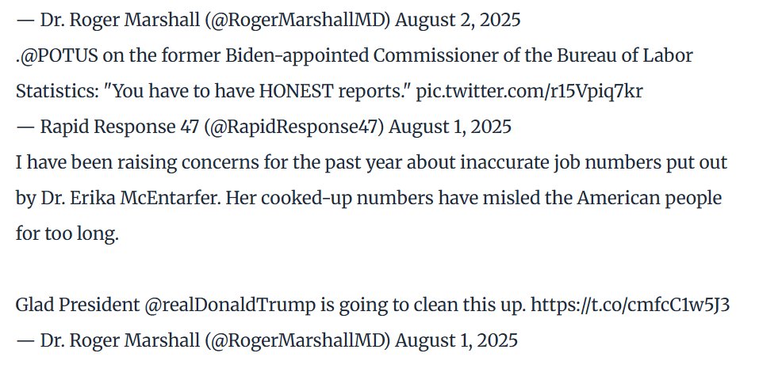

On August 1, 2025, President Donald Trump announced on Truth Social that he had directed his staff to fire Dr. Erika McEntarfer, the Commissioner of Labor Statistics. As head of the Bureau of Labor Statistics (BLS), Dr. McEntarfer oversaw all of the agency’s statistical programs and reports—none more closely watched than the Monthly Current Employment Statistics (CES) release, commonly referred to as “the jobs number.” This monthly report consistently moves financial markets, is analyzed by economists, investors, and business leaders, and is often treated by politicians and commentators as a central indicator of economic health.

The abrupt dismissal drew immediate criticism from economists across the political spectrum, who warned that even the perception of political interference could undermine long-term trust in BLS data. Supporters of the President’s decision highlighted recent CES revisions as evidence of potential problems, while defenders of BLS and Dr. McEntarfer acknowledged the agency’s methodological challenges but rejected the idea that they were politically motivated. As a former BLS Commissioner noted, the Commissioner has little to no ability to view or alter CES figures before release, and revisions are a normal, expected part of the process.

In this report, we will assess the truthfulness of these competing claims by conducting a fact check through various different analysis of BLS data sets.

# 1st Step
Data Ingestion - we will acquire the dataset of the CES estimates of total employment level of the United States and the dataset that shows the cylce-to-cycle revision of the CES estimate.

```{r}
#| echo: false
#| message: false
#| warning: false

library(httr2)
library(rvest)
library(dplyr)
library(tidyr)
library(stringr)
library(lubridate)
library(readr)
library(purrr)

if(!dir.exists(file.path("data", "mp04"))){
  dir.create(file.path("data", "mp04"), showWarnings = FALSE, recursive = TRUE)
}
get_ces <- function() {
  resp <- request("https://data.bls.gov/pdq/SurveyOutputServlet") |>
    req_method("POST") |>
    req_body_form(
      request_action = "get_data", reformat = "true", from_results_page = "true",
      from_year = "1979", to_year = "2025", initial_request = "false", data_tool = "surveymost",
      series_id = "CES0000000001", original_annualAveragesRequested = "false") |>
    req_perform()

  tables <- resp_body_html(resp) |>
    html_elements("table")

  tbl <- tables |>
    map(~ html_table(.x, fill = TRUE)) |>
    keep(~ ncol(.x) > 5) |>
    first()

  ces_level <- tbl |>
    mutate(Year = as.integer(Year)) |>
    pivot_longer(cols = -Year, names_to = "month", values_to = "level") |>
    mutate(month = str_sub(month, 1, 3), date  = ym(paste(Year, month)), level = as.numeric(str_replace(level, ",", ""))
    ) |>
    drop_na(level, date) |>
    arrange(date) |>
    select(date, level) |>
    filter(date <= as.Date("2025-06-01"))

  ces_level
}
ces <- get_ces()
DT::datatable(
  ces,
  options = list(pageLength = 5, scrollX = TRUE),
  caption = "CES Total Nonfarm Payroll"
)
```
```{r}
#| echo: false
#| message: false
#| warning: false
library(tibble)

resp <- request("https://www.bls.gov/web/empsit/cesnaicsrev.htm")
resp <- req_user_agent(resp, "Mozilla/5.0 (Windows NT 10.0; Win64; x64) AppleWebKit/537.36 (KHTML, like Gecko) Chrome/120.0.0.0 Safari/537.36")
resp <- req_headers(resp, "Referer" = "https://www.bls.gov/")
resp <- req_perform(resp)

page_html <- resp_body_html(resp)

tables_raw <- html_elements(page_html, "table") |> 
  map(function(tbl) html_table(tbl, header = FALSE, fill = TRUE))

get_ces_revisions_year <- function(year) {
  year_table <- tables_raw |>
    keep(function(x) {
      if (ncol(x) < 5) return(FALSE)
      yr_col <- suppressWarnings(as.integer(x[[2]]))
      any(yr_col == year, na.rm = TRUE)
    }) |>
    first()
  
  year_tbl <- as_tibble(year_table)
  names(year_tbl) <- paste0("V", seq_len(ncol(year_tbl)))
  
  out <- year_tbl |>
    mutate(year_num = suppressWarnings(as.integer(V2))) |>
    filter(year_num == year) |>
    slice(1:12) |>
    transmute(date     = ym(paste(year_num, month.abb[row_number()])), original = as.numeric(str_replace_all(V3, ",", "")),  
      final    = as.numeric(str_replace_all(V5, ",", "")), revision = final - original)

  out
}

all_years <- 1979:2025

ces_revisions <- map_dfr(all_years, get_ces_revisions_year) |>
  filter(date <= as.Date("2025-06-01")) |>
  arrange(date)

DT::datatable(
  ces_revisions,
  options = list(pageLength = 5, scrollX = TRUE),
  caption = "CES Revisions"
)
```
# 2nd Step
Data Exploration - we will now explore the data in various ways.

These first two visualizations show the changes in total employment since 1979.
```{r}
#| echo: false
#| message: false
#| warning: false
library(ggplot2)
library(stringr)
ces %>%
  mutate(year = year(date)) %>%
  ggplot(aes(x = date, y = level)) +
  geom_col(fill = "steelblue") +
  labs(
    title = "U.S. Employment Level (1979–2025)",
    subtitle = "Total Nonfarm Payroll Employment (thousands)",
    x = "Year",
    y = "Employment Level"
  ) +
  theme_minimal(base_size = 14)

annual_levels <- ces %>%
  mutate(year = year(date)) %>%
  group_by(year) %>%
  summarize(level = last(level), .groups = "drop")

annual_change <- annual_levels %>%
  mutate(change = level - lag(level),
         direction = case_when(
           is.na(change) ~ NA_character_,
           change > 0 ~ "Increase",
           change < 0 ~ "Decrease",
           TRUE ~ "No Change"
         ))

annual_change <- annual_change %>%
  mutate(decade = paste0(floor(year / 10) * 10, "s"))

decade_summary <- annual_change %>%
  filter(!is.na(direction), direction != "No Change") %>%
  count(decade, direction) %>%
  pivot_wider(names_from = direction, values_from = n, values_fill = 0)

plot_data <- decade_summary %>%
  pivot_longer(cols = c("Increase", "Decrease"), names_to = "type", values_to = "count")

ggplot(plot_data, aes(x = decade, y = count, fill = type)) +
  geom_col(position = "dodge") +
  scale_y_continuous(breaks = seq(0, max(plot_data$count), by = 2)) +
  labs(title = "Employment Levels by Decade", x = "Decade", y = "Number of Years", fill = "Employment Direction") +
  theme_minimal(base_size = 14)
emp_yearly <- ces %>%
  mutate(year = year(date)) %>%
  group_by(year) %>%
  summarize(avg_level = mean(level, na.rm = TRUE), pct_change_emp = (avg_level - lag(avg_level)) / lag(avg_level),
    .groups = "drop")

```

Now, we will take a look at the jobs added by each President during the duration of their service.
```{r}
#| echo: false
#| message: false
#| warning: false
pres_terms <- tibble(
  president = c(
    "Reagan", "Bush Sr", "Clinton", "Bush Jr",
    "Obama", "Trump", "Biden"
  ),
  start = as.Date(c(
    "1981-01-01", "1989-01-01", "1993-01-01",
    "2001-01-01", "2009-01-01", "2017-01-01", "2021-01-01"
  )),
  end = as.Date(c(
    "1988-12-01", "1992-12-01", "2000-12-01",
    "2008-12-01", "2016-12-01", "2020-12-01", "2024-12-01"
  ))
)

jobs_per_president <- function(start_date, end_date) {
  df <- ces %>%
    filter(date >= start_date, date <= end_date) %>%
    arrange(date)

  start_level <- first(df$level)
  end_level   <- last(df$level)

  jobs_added <- end_level - start_level
  return(jobs_added)
}

pres_results <- pres_terms %>%
  rowwise() %>%
  mutate(jobs_added = jobs_per_president(start, end)) %>%
  ungroup() %>%
  arrange(desc(jobs_added))

DT::datatable(
  pres_results,
  options = list(pageLength = 10, scrollX = TRUE),
  caption = "Total Jobs Added by U.S. Presidents Based on CES Employment Levels"
)
```

Next we will get more specific and look at the first 100 days of each presidency to view jobs added during that timeframe.
```{r}
#| echo: false
#| message: false
#| warning: false
presidents <- tibble(
  president = c("Reagan", "Bush Sr.", "Clinton", "Bush Jr.", "Obama", "Trump", "Biden"),
  start = ymd(c("1981-01-01", "1989-01-01", "1993-01-01", "2001-01-01",
                "2009-01-01", "2017-01-01", "2021-01-01")),
  end = ymd(c("1981-04-01", "1989-04-01", "1993-04-01", "2001-04-01",
              "2009-04-01", "2017-04-01", "2021-04-01"))
)

first_100_days <- presidents %>%
  rowwise() %>%
  mutate(
    start_level = ces %>% filter(date == start) %>% pull(level),
    end_level   = ces %>% filter(date == end) %>% pull(level),
    jobs_added  = end_level - start_level
  ) %>%
  ungroup()%>%
  arrange(desc(jobs_added))

DT::datatable(
  first_100_days,
  options = list(pageLength = 10, scrollX = TRUE),
  caption = "Total Jobs Added by U.S. Presidents in their first 100 days"
)
```
```{r}
#| echo: false
#| message: false
#| warning: false
percent_increase <- ces %>%
  arrange(date) %>%
  summarize(first_level = first(level), last_level  = last(level), pct_change  = (last_level - first_level) / first_level * 100)
DT::datatable(
  percent_increase,
  options = list(pageLength = 10, scrollX = TRUE),
  caption = "CES Total Nonfarm Payroll"
)
```

After viewing the numbers, we conclude that employment has increased almost 80% since 1979.

Next, we will take a look at CES revisions.

```{r}
#| echo: false
#| message: false
#| warning: false
ces_joined <- inner_join(
  ces,
  ces_revisions,
  by = "date"
)
```

The next visualization shows the volatily of the revisions from year to year.

```{r}
#| echo: false
#| message: false
#| warning: false

rev_yearly <- ces_revisions %>%
  mutate(year = lubridate::year(date)) %>%
  group_by(year) %>%
  summarize(avg_revision = mean(revision, na.rm = TRUE))

max_point <- rev_yearly %>% filter(avg_revision == max(avg_revision))
min_point <- rev_yearly %>% filter(avg_revision == min(avg_revision))

ggplot(rev_yearly, aes(x = year, y = avg_revision)) +
  geom_line(color = "steelblue", linewidth = 1) +
  geom_point(color = "darkred", size = 2) +
  
  geom_point(data = max_point, aes(x = year, y = avg_revision), color = "forestgreen", size = 4) +
  geom_point(data = min_point, aes(x = year, y = avg_revision), color = "purple", size = 4) +
  
  geom_hline(yintercept = 0, linetype = "dashed", color = "gray40") +
  labs(
    title = "Average CES Revision Per Year (1979–2025)",
    x = "Year", y = "Average Monthly Revision") +
  theme_minimal(base_size = 14)
```
Below we highlight the top 10 months with the highest positive and negative revisions.
```{r}
#| echo: false
#| message: false
#| warning: false
top10_positive <- ces_revisions %>%
  arrange(desc(revision)) %>%
  slice(1:10)
top10_negative <- ces_revisions %>%
  arrange(revision) %>%   
  slice(1:10)

DT::datatable(
  top10_positive,
  options = list(pageLength = 10, scrollX = TRUE),
  caption = "Top Positive Changes in CES levels"
)

DT::datatable(
  top10_negative,
  options = list(pageLength = 10, scrollX = TRUE),
  caption = "Top Negative Changes in CES levels"
)
```

The next visualization shows the volatility of the revisions as a percentage of CES total nonfarm payroll.
```{r}
#| echo: false
#| message: false
#| warning: false
ces_joined <- ces_joined %>%
  mutate(
    pct_revision = (revision / level) * 100 
  )
rev_pct_yearly <- ces_joined %>%
  mutate(year = year(date)) %>%
  group_by(year) %>%
  summarize(
    avg_pct = mean(pct_revision, na.rm = TRUE),
    .groups = "drop"
  )

ggplot(rev_pct_yearly, aes(x = year, y = avg_pct)) +
  geom_line(color = "steelblue", linewidth = 1) +
  geom_point(color = "darkred", size = 1.8) +
  geom_hline(yintercept = 0, linetype = "dashed", color = "gray50") +
  labs(
    title = "Average CES Revision as % of Employment Level (Signed, 1979–2025)",
    x = "Year",
    y = "Average Monthly Revision (%)"
  ) +
  theme_minimal(base_size = 14)
```

Next we will show the top 10 positive and negative % changes in revisions based on employment levels.
```{r}
#| echo: false
#| message: false
#| warning: false
top_pos <- ces_joined %>%
  arrange(desc(pct_revision)) %>%
  slice(1:10)

top_neg <- ces_joined %>%
  arrange(pct_revision) %>%
  slice(1:10) 

DT::datatable(
  top_pos,
  options = list(pageLength = 10, scrollX = TRUE),
  caption = "Top positive % CES Revisions based on CES levels"
)

DT::datatable(
  top_neg,
  options = list(pageLength = 10, scrollX = TRUE),
  caption = "Top negative % CES Revisions based on CES levels"
)
```
The next visualization highlights the best and worst year in regards to most positive amount of revisions and most negative amount of revisions.
```{r}
#| echo: false
#| message: false
#| warning: false
rev_monthly <- ces_revisions %>%
  mutate(
    year      = year(date),
    month_num = month(date)
  ) %>%
  group_by(year, month_num) %>%
  summarize(
    revision = mean(revision, na.rm = TRUE),
    .groups = "drop"
  ) %>%
  mutate(
    month_label = factor(
      month_num,
      levels = 1:12,
      labels = month.abb
    )
  )

ggplot(rev_monthly, aes(x = month_label, y = revision, group = year)) +
  geom_line(color = "grey75", alpha = 0.5) +
  
  geom_line(
    data = dplyr::filter(rev_monthly, year == 2008),
    aes(x = month_label, y = revision, group = year),
    color = "red",
    linewidth = 1.2
  ) +
  
  geom_line(
    data = dplyr::filter(rev_monthly, year == 2021),
    aes(x = month_label, y = revision, group = year),
    color = "blue",
    linewidth = 1.2
  ) +
  
  labs(
    title = "Monthly CES Revisions by Year",
    subtitle = "Red = 2008 (most negative), Blue = 2021 (most positive)",
    x = "Month",
    y = "Revision (thousands of jobs)"
  ) +
  theme_minimal(base_size = 14)
```
The following tables breakdown the most positive and negative years in terms of revisions.

The last table shows how positive each decade was in terms of revisions.
```{r}
#| echo: false
#| message: false
#| warning: false
rev_positive_pct <- ces_revisions %>%
   mutate(
    year = year(date),
    is_positive = revision > 0
  ) %>%
  group_by(year) %>%
  summarize(
    total_months = n(),
    positive_months = sum(is_positive, na.rm = TRUE),
    pct_positive = (positive_months / total_months) * 100,
    .groups = "drop"
  ) %>%
  arrange(desc(pct_positive)) %>%
  slice(1:10)
rev_positive_pct
neg_years <- ces_joined %>%
  mutate(year = year(date)) %>%
  group_by(year) %>%
  summarize(
    total_negative_revisions = sum(revision < 0, na.rm = TRUE),
    total_months = n(),
    pct_negative = total_negative_revisions / total_months * 100,
    .groups = "drop"
  ) %>%
  arrange(desc(total_negative_revisions)) %>%
  slice(1:10)

neg_years
rev_decade <- ces_joined %>%
  mutate(
    year = year(date),
    decade = paste0(floor(year / 10) * 10, "s"),   
    positive = revision > 0                        
  ) %>%
  group_by(decade) %>%
  summarize(
    total_months = n(),
    positive_months = sum(positive, na.rm = TRUE),
    pct_positive = (positive_months / total_months) * 100,
    .groups = "drop"
  ) %>%
  arrange(decade)

rev_decade
```
The last visualization highlights the average revision on an election year vs the average revision on the first year of new presidential term.
```{r}
#| echo: false
#| message: false
#| warning: false

highlight_years <- c(2024, 2020, 2016, 2012, 2008, 2004, 2000, 1996, 1992, 1988, 1984, 1980)

highlight_next_years <- highlight_years + 1

rev_yearly <- ces_revisions %>%
  mutate(year = year(date)) %>%
  group_by(year) %>%
  summarize(avg_revision = mean(revision, na.rm = TRUE), .groups = "drop")

rev_yearly <- rev_yearly %>%
  mutate(
    category = case_when(
      year %in% highlight_years ~ "Highlighted Years",
      year %in% highlight_next_years ~ "Following Years",
      TRUE ~ "Other Years"
    )
  )

ggplot(rev_yearly, aes(x = year, y = avg_revision, color = category, group = 1)) +
  geom_line(color = "gray60") +
  
   geom_point(data = subset(rev_yearly, category == "Highlighted Years"),
             color = "blue", size = 4) +
  geom_point(data = subset(rev_yearly, category == "Following Years"),
             color = "orange", size = 4) +

  geom_hline(yintercept = 0, linetype = "dashed", color = "gray40") +
  
  labs(
    title = "Average CES Revision by Year (1979–2025)",
    subtitle = "Blue = Election Year, Orange = Following Year",
    x = "Year",
    y = "Average Revision (Final – Original, Thousands)"
  ) +
  theme_minimal(base_size = 14)
```

# 3rd Step
Statistical Analysis - we will analyze the data using t_test and prop_test.

```{r}
#| echo: false
#| message: false
#| warning: false
library(infer)
rev_change <- ces_revisions %>%
  mutate(
    year   = year(date),
    period = if_else(year <= 2020, "pre_2020", "post_2020"),
    abs_rev = abs(revision)
  ) %>%
  
  t_test(
    abs_rev ~ period,
    order = c("post_2020", "pre_2020"),  
    alternative = "two_sided"
  )

rev_change   
```

Revisions have become larger after 2020, but this increase is not statistically significant at the 5% level.
There is weak evidence (significant at 10%) that revisions grew after 2020, but the confidence interval includes the possibility of no change.
```{r}
#| echo: false
#| message: false
#| warning: false

rev_neg_data <- ces_revisions %>%
  mutate(
    year   = year(date),
    period = if_else(year <= 2000, "pre_2000", "post_2000"),
    neg_cat = if_else(revision < 0, "negative", "non_negative")
  )

rev_neg_test <- rev_neg_data %>%
  prop_test(
    neg_cat ~ period,
    success = "negative",          
    alternative = "two_sided"
  )

rev_neg_test  
```

There is no evidence that the proportion of negative revisions changed after 2000.
The fraction of downward revisions before 2000 is statistically indistinguishable from the fraction after 2000.

# Fact Checks
We will now take a look at a couple of statements by politicians regarding the firing and determine whether or not they are factual. 

### Roger Marshall
{width=80%}

Claim is highlighting that Dr.Erika was purposely inflating job numbers in order to show high negative revisions.

Based on the table below, this is worst 6 month period in regards to accuracy that did not involve a month taking place during the 2008 financial crisis nor COVID-19.
```{r}
#| echo: false
#| message: false
#| warning: false
library (slider)
rev_ordered <- ces_revisions %>%
  arrange(date)

rev_windows <- rev_ordered %>%
  mutate(
    window_sum = slide_dbl(
      revision,
      sum,
      .before = 5,         
      .complete = TRUE     
    )
  ) %>%
  mutate(
    window_start = lag(date, 5),
    window_end   = date
  ) %>%
  filter(!is.na(window_sum))

worst_20_windows <- rev_windows %>%
  arrange(window_sum) %>%
  slice(1:20) %>%
  select(window_start, window_end, window_sum)

worst_20_windows
```
Next, the two visuals above show that in the year 2008 and 2020, both the employment levels were lowering while the CES revisions were also in the negative. 

2025 marks the first year were the revisions are constantly in the negative, but employment levels were mostly rising.

```{r}
#| echo: false
#| message: false
#| warning: false
ces_2025 <- ces %>%
  filter(date >= as.Date("2024-12-01"),
         date <= as.Date("2025-12-01")) %>%
  arrange(date) %>%
  mutate(
    month = format(date, "%Y-%m"),
    CES_level_change = level - lag(level)  
  ) %>%
  filter(year(date) == 2025) %>%
  select(date, month, level, CES_level_change)

DT::datatable(
  ces_2025,
  options = list(pageLength = 10, scrollX = TRUE),
  caption = "CES Total Nonfarm Payroll for 2025"
)
```
However, the quote states that Dr. Marshall had been complaining for the past year for inflated numbers.

We see below the absolute revision as % of the employment level for this time frame.
```{r}
#| echo: false
#| message: false
#| warning: false
revisions_2024_2025 <- ces_revisions %>%
  filter(
    date >= as.Date("2024-07-01"),
    date <= as.Date("2025-06-01")
  ) %>%
  arrange(date)

rev_pct_2024_2025 <- revisions_2024_2025 %>%
  left_join(ces, by = "date") %>%  
  mutate(
    abs_pct_revision = abs(revision) / level * 100
  )
DT::datatable(
  rev_pct_2024_2025,
  options = list(pageLength = 10, scrollX = TRUE),
  caption = "Revisions from July 2024 to June 2025"
)
```
Based on the above and the T-test conducted earlier, even though revisions have become larger after 2020, this increase is not statistically significant.

**Political Fact-o-Meter** - Mostly False

### Fake Claim
### "The economy is booming, jobs!jobs!jobs!" - June 2025

Claim is highlighting that the economy is strong despite recent negative revisions.

The first visualization shows that the total number of jobs is steadily increasing, despite the third visualization showing that 2025 has had on average a negative revision for the entire year. One can suggest that it is an overstimation of how many jobs are created, that jobs are still increasing.

```{r}
#| echo: false
#| message: false
#| warning: false
ces_changes <- ces %>%
  arrange(date) %>%
  mutate(
    change = level - lag(level)
  )

ces_decreases <- ces_changes %>%
  filter(change < 0)

last_negative_before_june_2025 <- ces_decreases %>%
  filter(date < as.Date("2025-06-01")) %>%
  slice_tail(n = 1)

last_negative_before_june_2025
```
Based on the table above, December 2020 is the last month that job levels had decrease.

That is until June 2025.

The table below is going to show the lowest increase in job levels during a 6-month period.

```{r}
#| echo: false
#| message: false
#| warning: false
ces_levels <- ces %>% arrange(date)

level_windows <- ces_levels %>%
  mutate(
    six_month_change = level - lag(level, 5),
    window_start = lag(date, 5),
    window_end   = date
  ) %>%
  filter(!is.na(six_month_change))

positive_windows <- level_windows %>%
  filter(six_month_change > 0)

lowest_positive_windows <- positive_windows %>%
  arrange(six_month_change) %>%
  slice(1:50) %>%
  select(window_start, window_end, six_month_change)

DT::datatable(
  lowest_positive_windows,
  options = list(pageLength = 10, scrollX = TRUE),
  caption = "Worst 6-month window of jobs increases"
)
```
Jan to Jun 2025 turns to be in the top 35.

In comparison to the best windows of job levels increase below, this 6-month window is not close.
```{r}
#| echo: false
#| message: false
#| warning: false
ces_ordered <- ces %>%
  arrange(date)

ces_changes <- ces_ordered %>%
  mutate(
    level_change = level - lag(level)
  )

ces_windows <- ces_changes %>%
  mutate(
    window_sum = slide_dbl(
      level_change,
      sum,
      .before = 5,      
      .complete = TRUE
    ),
    window_start = lag(date, 5),  
    window_end   = date           
  ) %>%
  filter(!is.na(window_sum))

best_50_windows <- ces_windows %>%
  arrange(desc(window_sum)) %>%
  slice(1:50) %>%
  select(window_start, window_end, window_sum)

DT::datatable(
  best_50_windows,
  options = list(pageLength = 10, scrollX = TRUE),
  caption = "Best 6-month window of jobs increases"
)
```
Lastly, we will conduct a t-test to determine whether the average job growth from Jan–Jun 2025 is significantly different from zero.
```{r}
#| echo: false
#| message: false
#| warning: false
ces_2025 <- ces %>%
  filter(date >= as.Date("2025-01-01"), date <= as.Date("2025-06-01")) %>%
  arrange(date) %>%
  mutate(change = level - lag(level)) %>%
  filter(!is.na(change))

t_test_2025_change <- t.test(ces_2025$change, mu = 0, alternative = "greater")

t_test_2025_change
```

At the 5% level, there is statistically significant evidence of positive job growth. Though, since the mean growth value is extremely small, the result may be statistically significant but not economically meaningful.

**Political Fact-o-Meter** - Half True

Last Updated: `r format(Sys.time(), "%A %m %d, %Y at %H:%M%p")`